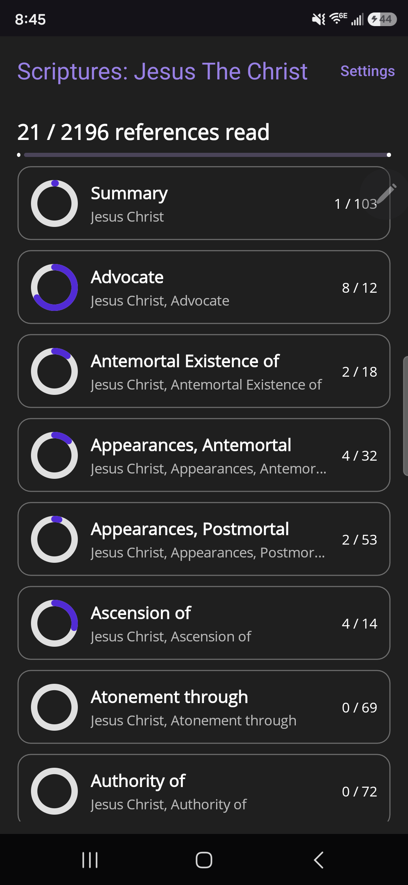
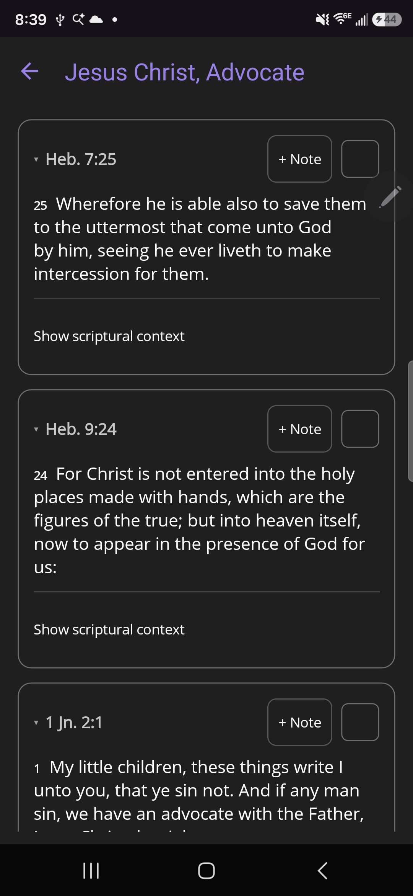
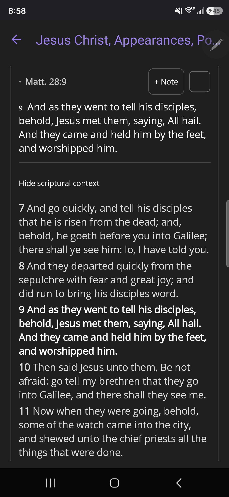
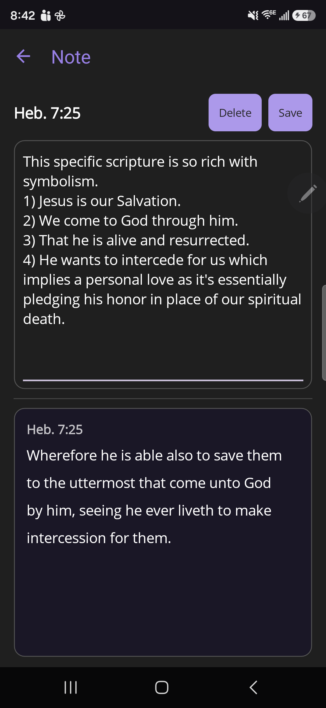
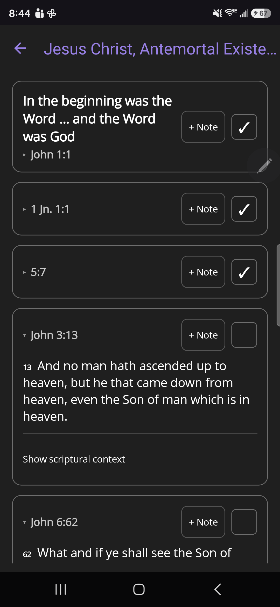
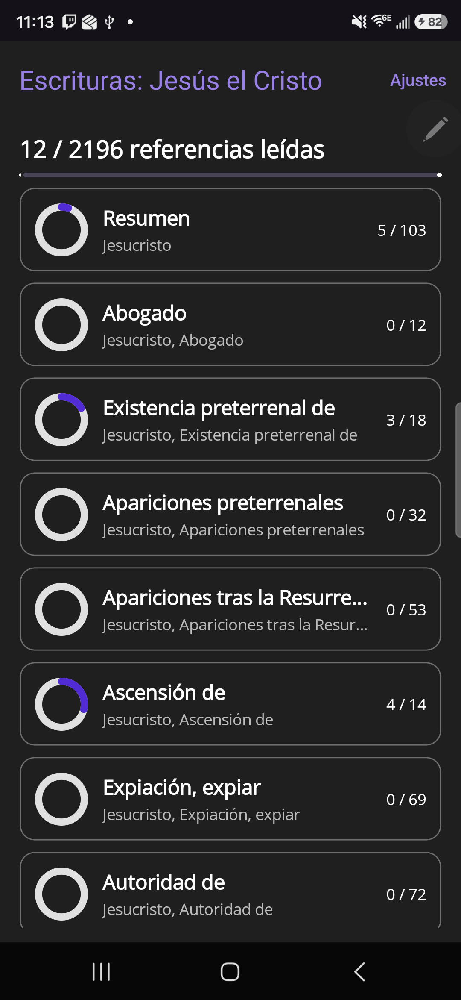

# Scriptures: Jesus the Christ

## English

One day in church I came upon [an invitation](https://www.churchofjesuschrist.org/study/broadcasts/worldwide-devotional-for-young-adults-an-evening-with-president-nelson/2017/01/prophets-leadership-and-divine-law?lang=eng) by President Nelson, the late prophet of the Church of Jesus Christ of Latter-day Saints. He invited everyone to read all 2200 scriptures from the Topical Guide about Jesus Christ. For those that don't know, the Topical Guide is a great reference but was built for print. It will get you flipping pages like a pro. There's value in that. Sometimes working with print is its own beauty.

Then my brain said, "What if you could make a feed from all those references and make it act like social media, then fill all those micro-moments with learning about becoming a better human being instead?".  

Well brain, challenge accepted. This app currently has 2 languages, English and Spanish but is built so you can pick it up and put it down easily as its ergonomics were specifically written with a phone in mind. It especially excels in helping use those micro-moments accepting President Nelson's invitation, and you can even track your progress as you do it. I hope you enjoy using it as much as I do.

## Español

Un día en la iglesia me encontré con [una invitación](https://www.churchofjesuschrist.org/study/broadcasts/worldwide-devotional-for-young-adults-an-evening-with-president-nelson/2017/01/prophets-leadership-and-divine-law?lang=spa) del presidente Nelson, el difunto profeta de la Iglesia de Jesucristo de los Santos de los Últimos Días. Él invitó a todos a leer las cerca de 2200 escrituras sobre Jesucristo que reúne la Guía para el Estudio de las Escrituras (el "Topical Guide"). Para quienes no la conocen, es una referencia excelente, pero fue creada para el formato impreso: te hará pasar páginas como todo un profesional. Eso tiene su valor; a veces trabajar con lo impreso tiene su propia belleza.

Entonces mi mente me dijo: "¿Y si tomaras todas esas referencias y las convirtieras en un 'feed', como en las redes sociales, para llenar esos micro-momentos aprendiendo a ser un mejor ser humano?".

Pues bien, mente: desafío aceptado. Por ahora esta aplicación tiene dos idiomas, inglés y español, y está hecha específicamente para que puedas tomarla y dejarla con facilidad, ya que su ergonomía se diseñó pensando en el teléfono. Destaca sobre todo para aprovechar esos micro-momentos y aceptar la invitación del presidente Nelson, y además puedes seguir tu progreso mientras lo haces. Espero que la disfrutes tanto como yo.

## Screenshots

|  |  |  |
|:--:|:--:|:--:|
|  |  |  |
| **Home & progress** | **The feed** | **Scriptural context** |
|  |  |  |
| **Personal notes** | **Mark as read** | **En español** |
